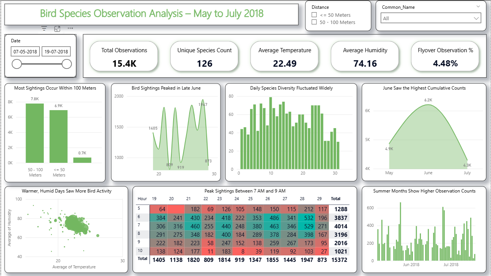

🐦 Bird Observations Analysis — Python & Power BI
📌 Project Overview
This project analyzes bird observation data using Python for cleaning, transformation, and exploratory data analysis (EDA), followed by advanced Power BI dashboards for visualization.
The goal is to uncover patterns in bird species distribution, environmental conditions, and observation trends.

📂 Dataset
File: bird_observations_cleaned.csv
Source: Provided raw observation dataset containing 15,372+ records with environmental and bird-specific details.

Key Columns:
Admin_Unit_Code, Site_Name, Plot_Name — Location details

Year, Date, Start_Time, End_Time — Observation timing

Distance, Distance_numeric — Distance of sighting from observer

Temperature, Humidity, Sky, Wind — Environmental factors

Common_Name, Scientific_Name, Sex — Bird species and characteristics

Initial_Three_Min_Cnt — Bird count in first 3 minutes

🛠 Tools & Technologies
Python: Pandas, NumPy, Matplotlib, Seaborn

Jupyter Notebook: Data preprocessing & EDA

Power BI: Interactive dashboards & DAX measures

GitHub: Version control & portfolio hosting

🔍 Steps & Workflow
1. Data Cleaning in Python
Loaded raw dataset using Pandas

Handled missing values without aggressive filtering to retain valuable data

Converted categorical Distance values (e.g., "<= 50 Meters") into a numeric column Distance_numeric

Verified data types and ranges

2. Exploratory Data Analysis (EDA)
Summary statistics & distribution plots

Environmental condition trends (Temperature, Humidity)

Most observed bird species

Relationship between distance and count

Saved cleaned dataset as bird_observations_cleaned.csv

3. Power BI Dashboard
Imported cleaned dataset

Created calculated columns (Month, Season)

Built key DAX measures:

Total Observations

Unique Species Count

Average Temperature & Humidity

Observation Frequency by Month

Advanced visuals:

Species distribution heatmap

Environmental condition scatter plots

Trend over time charts

Top observed species

Interactive slicers (Year, Season, Location, Species)

📊 Dashboard Highlights
Title: Bird Observation Trends & Insights

Slicers: Year, Month, Season, Location, Species

Charts:

Top 10 most observed species

Temperature vs. Humidity bubble chart (sized by total observations)

Monthly trends in bird sightings

Geographic distribution by Admin Unit

Environmental condition impact on observations

🚀 Key Insights
Certain species are more active in specific environmental conditions

Humidity & temperature ranges affect bird sighting frequency

Top observed species dominate a majority of the counts

Morning observations (first 3 minutes) capture most activity

📜 License
This project is released under the MIT License.

👤 Author
Ronak Patel

📧 Email: ronakpatel171990@gmail.com

🌐 Portfolio: (https://ronakpatel.online/)

💼 LinkedIn: https://www.linkedin.com/in/ronak-patel1790/

